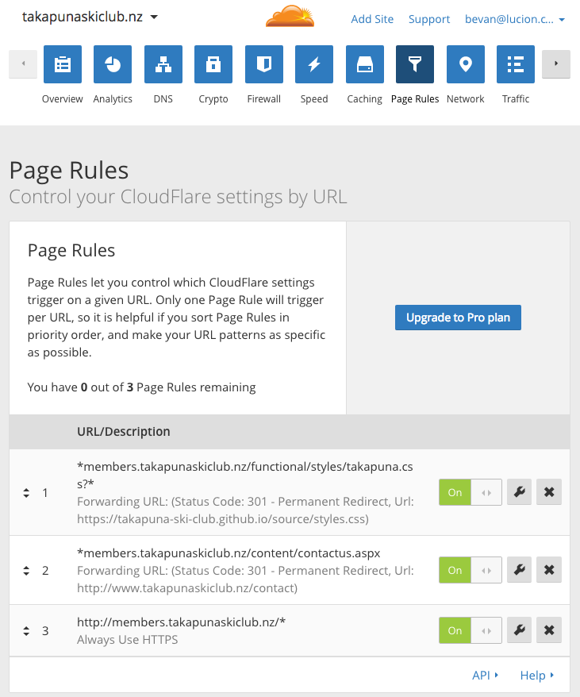

# Custom styles for Club System

**Em Development** manages an instalation of their **Club System** web application for **Takapuna Ski Club (TSC)**.  This is customized for TSC via configuration parameters, two images and one stylesheet.

## Installation

Em Development deploys the following to our managed instalation of Club System;

- `takapuna.css` Note the redirect.  See [Redirects](#redirects) in this document.
- `leftimage.jpg`
- `rightimage.jpg`

## Maintenance

TSC can then deploy changes by merging changes into `styles.css` in the `master` branch.  Changes to images still need to be done by Em Dev.

## Testing

The `Example screenshots` directory shows how the styled pages should look once styles are applied correctly.

## Redirects

Some redirects are configured in [CloudFlare](https://www.cloudflare.com/a/page-rules/takapunaskiclub.nz).  CloudFlare is an HTTP proxy and CDN. CloudFlare also hosts DNS records for `takapunaskiclub.nz`.

The redirects only impact `members.takapunaskiclub.nz`.  To bypass CloudFlare and test Club System directly, use [`takapuna.emdev.com.au`](http://takapuna.emdev.com.au/).

The redirects are;

1. Insecure HTTP to secure HTTPS, with a shared CloudFlare SSL certificate
2. `*members.takapunaskiclub.nz/functional/styles/takapuna.css?*` to [`https://takapuna-ski-club.github.io/source/styles.css`](https://takapuna-ski-club.github.io/styles.css)
3. `*members.takapunaskiclub.nz/content/contactus.aspx` to [`http://www.takapunaskiclub.nz/contact`](http://www.takapunaskiclub.nz/contact)

## Screenshot of page rules (redirects) in CloudFlare

